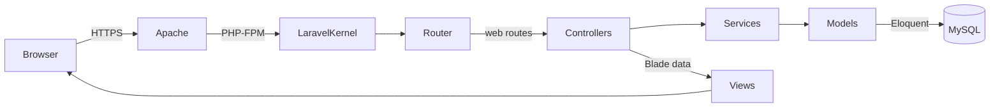
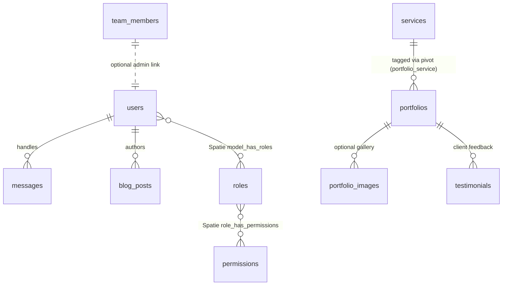

# Implementation Document - CV Devgenfour Company Profile (Laravel 12, PHP 8.3)

## 1. Introduction & Objectives
This document translates the functional requirements in `PRD.md` into a concrete implementation plan for engineers. The goal is to deliver a maintainable company profile website for CV Devgenfour with a Laravel 12 backend, Bootstrap 5 frontend, Spatie-powered role/permission and SEO management, and MySQL storage. The implementation must provide public-facing marketing pages, an authenticated admin portal for content management, and supporting infrastructure for deployment to a VPS or shared hosting environment.

## 2. Technology Environment
### 2.1 Local Setup (Laragon v6)
- Enable PHP 8.3, Apache, and MySQL within Laragon.
- Create a new Laragon project directory `profile_devgenfour` and map the virtual host `http://devgenfour.test`.
- Ensure Node.js >= 18 and npm >= 9 are installed (Laragon bundle or manual install).

### 2.2 Base Installation
```powershell
# Inside d:\laragon\www\profile_devgenfour
composer create-project laravel/laravel="^12.0" .
php artisan key:generate
```

### 2.3 Composer Dependencies
```powershell
composer require spatie/laravel-permission spatie/laravel-sitemap spatie/laravel-seo
composer require --dev laravel/pint pestphp/pest phpunit/phpunit
```

### 2.4 NPM Tooling
```powershell
npm install
npm install bootstrap@5.3.3 @popperjs/core laravel-vite-plugin sass
npm run dev   # hot reload during development
```

### 2.5 Configuration (.env)
- Duplicate `.env.example` to `.env` and set:
  - `APP_NAME=Devgenfour`
  - `APP_ENV=local`
  - `APP_URL=http://devgenfour.test`
  - MySQL credentials per Laragon defaults (`DB_USERNAME=root`, empty password).
- For production, create `.env.production` with hardened values (`APP_ENV=production`, `APP_DEBUG=false`, mail & queue configs).

## 3. System Architecture
### 3.1 MVC Request Flow


### 3.2 Directory & Layering Conventions
```
app/
  Http/
    Controllers/
      Admin/
      Frontend/
    Middleware/
    Requests/
  Models/
  Services/
bootstrap/
config/
database/
  migrations/
  seeders/
public/
resources/
  views/
    layouts/
    components/
    frontend/
    admin/
  js/
  sass/
routes/
  web.php
  admin.php
```
- Split admin and public controllers (`Admin\*Controller`, `Frontend\*Controller`).
- Use dedicated routes file `routes/admin.php` for authenticated dashboard, loaded in `RouteServiceProvider`.
- Service layer (`app/Services`) handles reusable business logic (e.g., SEO metadata builder, contact notification service).

### 3.3 Route Overview
- Public (`routes/web.php`):
  - `/` (Landing/HomeController@index)
  - `/tentang-kami`, `/layanan`, `/portofolio`, `/testimoni`, `/kontak`
  - `/blog` and `/blog/{slug}` (optional if blog enabled)
- Admin (`routes/admin.php`):
  - `/admin/login` (Laravel Fortify/ Breeze layout)
  - Authenticated group prefixed with `/admin` for dashboard, CRUD resources, SEO settings, message inbox.

## 4. Database Design
### 4.1 Entity-Relationship Diagram


### 4.2 Tables & Notes
- **users**: Admin accounts only. Passwords hashed (`bcrypt`). Use Spatie `HasRoles`.
- **roles / permissions**: Seed default roles (`super-admin`, `content-manager`, `seo-specialist`). Use Spatie migrations plus custom seeder.
- **services**: Title, description, font-awesome/bootstrap icon, ordering.
- **portfolios**: Title, slug, summary, body, main image path, client, project date, status flag, featured flag.
- **portfolio_images** (new): Additional gallery images per portfolio.
- **testimonials** (optional): Name, role, company, content, rating, order.
- **team_members**: Name, position, bio, photo path, LinkedIn link, email.
- **messages**: Captures contact form submissions. Optionally store read status.
- **blog_posts** (optional per PRD): Title, slug, markdown body, category_id (future proof), thumbnail, meta JSON.
- **settings**: Key-value storage (e.g., hero headline, company info). Managed via admin UI.
- **seo_meta**: Table storing overrides per route (model type, model id, meta_title, meta_description, open graph data) if not using only Spatie SEO resources.

Run migrations:
```powershell
php artisan migrate
php artisan db:seed --class=InitialSetupSeeder
```

## 5. Implementation Plan
1. **Project Bootstrap**
   - Initialize Laravel project, configure .env, run `php artisan key:generate`.
   - Configure Vite, install Bootstrap 5 SASS setup.
2. **Core Packages & Auth**
   - Install & configure Laravel Breeze (Blade) for admin authentication.
   - Integrate Spatie Permission; publish config, run migrations, seed roles/permissions.
3. **Database Schema**
   - Generate migrations using `php artisan make:migration` for all required domain tables.
   - Implement Eloquent models with relationships & casts.
4. **Admin Panel**
   - Scaffold dashboard layout, navigation, and route groups with `auth` & `role` middleware.
   - Build CRUD modules (Services, Portfolio, Team, Blog, Settings, SEO, Messages) with request validation, policies, soft deletes where appropriate.
5. **Public Website**
   - Build Blade layouts using Bootstrap 5, dynamic sections fed from database.
   - Implement SEO meta rendering, sitemap generation, structured data.
6. **Content & Media Management**
   - Add storage disk configuration (`public`), implement image uploading (spatie/laravel-medialibrary optional or Laravel filesystem).
   - Optimize images via queued jobs (optional).
7. **Quality Assurance**
   - Write Pest feature tests for major flows (admin CRUD, contact form). Add CI workflow using GitHub Actions.
8. **Deployment Preparation**
   - Optimize configuration (`php artisan config:cache`, `route:cache`), generate production build `npm run build`.
   - Document deployment steps for VPS/shared hosting and SSL setup.
9. **Post-Launch Maintenance**
   - Establish backup strategy (database dumps, storage sync), schedule `php artisan schedule:run`, monitor logs.

## 6. Module Implementation Details
### 6.1 Backend (Laravel)
- **Models**: `User`, `Service`, `Portfolio`, `PortfolioImage`, `TeamMember`, `Testimonial`, `BlogPost`, `Message`, `Setting`, `SeoMeta`.
- **Controllers**:
  - Frontend: `HomeController`, `AboutController`, `ServiceController`, `PortfolioController`, `BlogController`, `ContactController`.
  - Admin: `DashboardController`, `ServiceController`, `PortfolioController`, `PortfolioImageController`, `TeamMemberController`, `TestimonialController`, `BlogPostController`, `MessageController`, `SeoController`, `SettingController`, `UserController`.
- **Policies & Gates**:
  - Generate via `php artisan make:policy PortfolioPolicy --model=Portfolio`.
  - Map policies in `AuthServiceProvider`; enforce via middleware `->middleware('permission:portfolio.view')`.
- **Form Requests**:
  - Example command: `php artisan make:request StorePortfolioRequest`.
  - Validate slugs (`unique:portfolios,slug`), image mime types, date formatting.
- **Services/Actions**:
  - Create action classes in `app/Services` or `app/Actions` (e.g., `CreatePortfolioAction`, `SyncSeoMetaAction`) to encapsulate business logic.
- **Routing Snippet**:
  ```php
  // routes/admin.php
  Route::middleware(['auth', 'role:super-admin|content-manager'])->prefix('admin')->name('admin.')->group(function () {
      Route::get('/', DashboardController::class)->name('dashboard');
      Route::resource('services', ServiceController::class);
      Route::resource('portfolios', PortfolioController::class);
      Route::resource('team-members', TeamMemberController::class);
      Route::resource('blog-posts', BlogPostController::class);
      Route::resource('testimonials', TestimonialController::class)->only(['index','create','store','edit','update','destroy']);
      Route::resource('messages', MessageController::class)->only(['index','show','destroy']);
      Route::get('seo', [SeoController::class, 'index'])->name('seo.index');
      Route::post('seo', [SeoController::class, 'store'])->name('seo.store');
  });
  ```

### 6.2 Frontend (Blade + Bootstrap 5)
- **Layouts**:
  - `resources/views/layouts/app.blade.php` for public pages with shared header/footer.
  - `resources/views/layouts/admin.blade.php` for admin panel (sidebar, top bar).
- **Components** (`php artisan make:component`):
  - `HeroBanner`, `SectionHeading`, `ServiceCard`, `PortfolioGrid`, `TestimonialCarousel`, `ContactForm`.
- **Styling**:
  - Use SASS entry `resources/sass/app.scss` importing Bootstrap and custom variables:
    ```scss
    @import "bootstrap/scss/functions";
    $primary: #007BFF;
    @import "bootstrap/scss/bootstrap";
    ```
  - Compile via Vite (`resources/js/app.js` imports `../sass/app.scss`).
- **JavaScript Enhancements**:
  - Use Bootstrap components (Collapse, Carousel) with data attributes.
  - Optional: integrate Swiper.js for portfolio slider; install via npm if needed.
- **Content Binding**:
  - Controllers supply view models (e.g., `$portfolios = Portfolio::published()->latest()->take(6)`).
  - Use Blade conditionals to handle optional blog/testimonial sections.

### 6.3 Admin Panel
- **Dashboard Metrics**:
  - Query aggregated counts (`Portfolio::count()`, `Message::unread()->count()`).
  - Display charts using Chart.js (install via npm) or simple cards.
- **CRUD UX**:
  - Use tables with filters/search (Laravel Livewire optional; if adopted, add `livewire/livewire` dependency).
  - File uploads handled via `Storage::disk('public')`.
  - Flash notifications using Bootstrap alerts; centralize in `partials/alerts`.
- **Permissions Enforcement**:
  - Assign roles during seeding:
    ```php
    $admin = User::factory()->create([...]);
    $admin->assignRole('super-admin');
    ```
  - Use middleware `->middleware('permission:services.update')` on routes/buttons.
- **SEO Console**:
  - Provide form to manage meta title/description per route/model.
  - Persist using Spatie SEO `OnPageSeo` classes or custom `SeoMeta` table.

## 7. Security & Optimization
- **Authentication**: Use Laravel Breeze + Fortify for secure login, password reset, optional 2FA (Time-based OTP modules if required).
- **CSRF & Validation**: Laravel handles CSRF tokens automatically; ensure all forms include `@csrf`. Validation via Form Requests.
- **Authorization**: All admin routes protected by `auth` and `role` middleware. Granular permissions for CRUD operations.
- **Rate Limiting**: Apply throttle middleware on contact form and admin login (`Route::middleware('throttle:10,1')`).
- **Input Sanitization**: Use `Purifier` or `Illuminate\Support\Str::of($request->input)` to strip malicious HTML in rich text fields.
- **Caching**:
  - Use `php artisan config:cache`, `route:cache`, `view:cache` in production.
  - Implement `remember()` caching for frequently accessed public data (services, testimonials) with invalidation upon updates.
- **Code Quality**:
  - Enforce PSR-12 via `./vendor/bin/pint`.
  - Enable PHPStan/Psalm optionally for static analysis.

## 8. SEO & Accessibility
- **Spatie Laravel SEO**
  ```php
  // AppServiceProvider
  use Spatie\LaravelSeo\Seo;
  public function boot(): void
  {
      Seo::default()
          ->title('CV Devgenfour - Solusi Digital Profesional')
          ->description('Perusahaan pengembang Web, Mobile, dan IoT...')
          ->addMeta('og:type', 'website')
          ->addMeta('og:locale', 'id_ID');
  }
  ```
- **Per-page Meta**: In controllers, call `$seo = Seo::setTitle(...)->setDescription(...);`.
- **Sitemap**: Configure `spatie/laravel-sitemap` via scheduled command `php artisan sitemap:generate` to produce `public/sitemap.xml`.
- **Structured Data**: Embed JSON-LD blocks for organization & breadcrumb schema within Blade partial.
- **Accessibility**:
  - Ensure color contrast meets WCAG 2.1 AA (Bootstrap primary palette adjustments).
  - Use semantic HTML, ARIA labels for navigation and carousels, keyboard navigation support.
  - Provide alt text for images and ensure form labels/validation messages are screen-reader friendly.

## 9. Testing & QA
- **Feature Tests (Pest)**
  - Admin CRUD flows, permissions enforcement, login/logout, contact form submission.
  ```powershell
  php artisan test --testsuite=Feature
  ```
- **Unit Tests**
  - Model scopes (`Portfolio::published()`), services (SEO sync), request validation.
- **Browser Testing**
  - Use Laravel Dusk for end-to-end admin navigation (optional).
- **Static Analysis & Linting**
  - `./vendor/bin/pint`
  - `./vendor/bin/phpstan analyse app --level=max`
- **Manual QA Checklist**
  - Responsive checks across breakpoints.
  - Lighthouse audit (>90 performance & accessibility).
  - Verify translations fall back gracefully (if only Indonesian content available).
- **CI Integration**
  - GitHub Actions workflow:
    ```yaml
    name: CI
    on: [push, pull_request]
    jobs:
      test:
        runs-on: ubuntu-latest
        steps:
          - uses: actions/checkout@v4
          - uses: shivammathur/setup-php@v2
            with:
              php-version: '8.3'
          - run: composer install --prefer-dist
          - run: cp .env.example .env
          - run: php artisan key:generate
          - run: php artisan test
    ```

## 10. Deployment & Maintenance
- **Preparation**
  - Run `npm run build`, `php artisan config:cache`, `php artisan route:cache`, `php artisan view:cache`.
  - Ensure storage symlink: `php artisan storage:link`.
- **VPS Deployment (Ubuntu + Nginx)**
  1. Provision server, install PHP 8.3, Nginx, MySQL, Composer.
  2. Clone repository to `/var/www/devgenfour`.
  3. Copy production `.env`, run `composer install --optimize-autoloader`.
  4. Run migrations & seeders: `php artisan migrate --force`.
  5. Configure Nginx server block pointing to `public/index.php`.
  6. Set permissions (`chown -R www-data:www-data storage bootstrap/cache`).
  7. Enable supervisor/cron for `php artisan schedule:run` and queue workers if needed.
  8. Install SSL via Let's Encrypt (`certbot --nginx`) and force HTTPS.
- **Shared Hosting (cPanel/Apache)**
  - Upload project excluding `/vendor` (if using deployment pipeline) or use Git version control feature.
  - Point document root to `public/`.
  - Configure `.htaccess` rewrite for Laravel.
  - Run `composer install` via SSH or local vendor upload.
  - Set up scheduled task (`php artisan schedule:run` every minute).
- **Backup & Monitoring**
  - Database dumps scheduled daily (`mysqldump` or hosting backup service).
  - File backup for `storage/app/public`.
  - Monitor logs via `laravel-log-viewer` (optional) or shipping to external log service.
  - Keep dependencies updated monthly; run security audits (`composer audit`).
- **Maintenance Workflow**
  - Use GitHub Flow: feature branches -> pull request -> CI -> `main`.
  - Tag releases (`v1.0.0`) and document changelog.
  - Run `php artisan down` before maintenance windows, `php artisan up` after completion.
